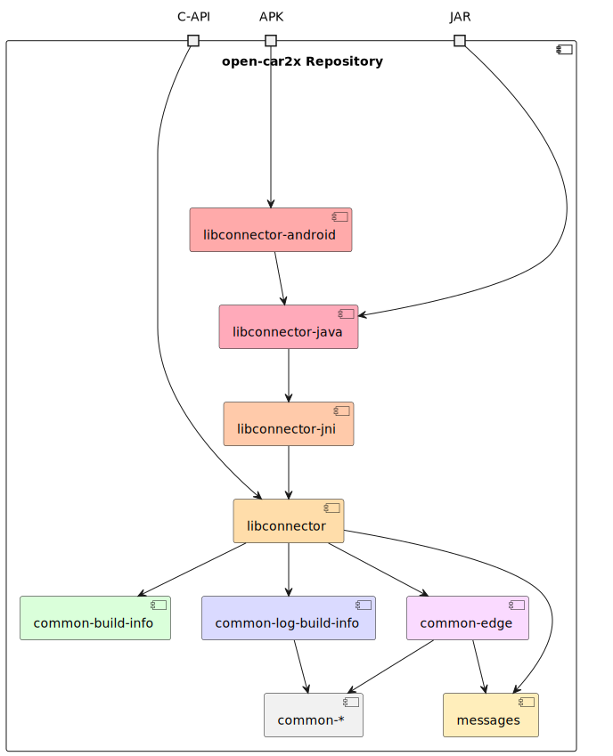
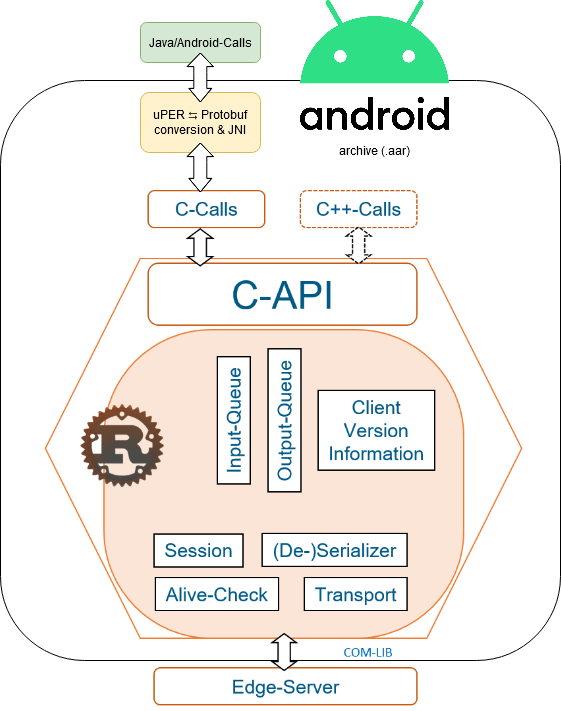
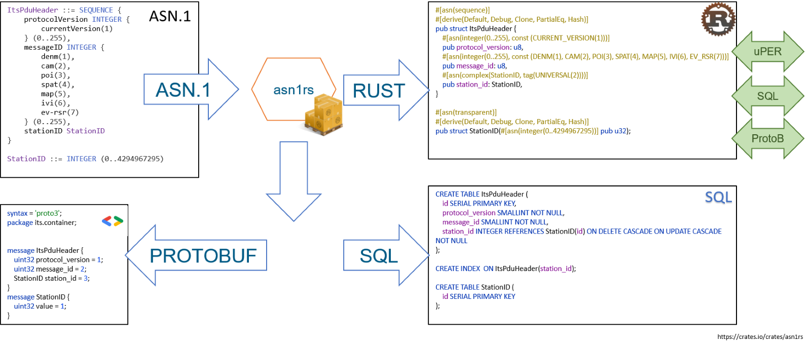

# Communication Library for Car2X projects

The code of this project was used for the communication in [LUKAS] and is now available as Open Source and licensed
under [GPLv3].

# Repository Structure

This repository is a rust [workspace](https://doc.rust-lang.org/cargo/reference/workspaces.html) and consists of
multiple crates (~ modules / libraries) representing libraries, binaries, and other deployables.
The following illustrates a general and simplified overview of the structure:



The main gist is that

- Internal **library crates are prefixed** with `common-*`.
- **Binaries** or more important crates (like `messages`, `asn1rs`, ...) are **not prefixed**.
- Binaries are usually very small crates around corresponding library crates which call into the library with parsed CLI
  and environment arguments as well as configured logger and tracer.
- External dependencies are often re-exported in the `common-*` crate they are introduced first to reduce the places a
  specific version of the external crate is mentioned in a `Cargo.toml`.

The following shows an illustration with a different focus.
While it explicitly mentions Android and `.aar` files, the same packaging structure applies for Java and `.jar` files.



See also [libconnector-android/libconnector-android/build.gradle Line 12](libconnector-android/libconnector-android/build.gradle), for the target configurations.

## Crate `messages` and the `protocol` directory

The crate `messages` contains generated Rust types of the used ASN.1 protocol descirptions.
It also contains small helper functions to (de-)serialize these types into/from `uPER`, `Protobuf` and `JSON`/`BSON`.

The directory `protocol` is a submodule containing the actual (`asn`) and generated message definitions as well as schema files and is structured like this:

```text
├── asn
│   ├── cam-pdu-descriptions.asn
│   ├── cpm-pdu-descriptions.asn
│   └── ...
├── proto
│   ├── cam_pdu_descriptions.proto
│   ├── compiler_test.proto
│   └── ...
└── sql
    ├── cam_pdu_descriptions.sql
    ├── compiler_test.sql
    └── ...
```

The [build script](https://doc.rust-lang.org/cargo/reference/build-scripts.html) at
[messages/build.rs](messages/build.rs) loads the `*.asn` files, creates `*.proto` definitions `*.sql`^1 and also writes to
`messages/src/` Rust data-structures, capable to be (de-)serialized from and to ASN.1 uPER and Protobuf:



^1: SQL bindings are deprecated / no longer used by [LUKAS]


[git-subtree]: https://manpages.debian.org/testing/git-man/git-subtree.1.en.html

# How to build and run

_A note on long **compile times**_: Due to the `profile.release` configuration in [the workspace Cargo.toml](Cargo.toml),
the build takes extra long (mostly caused by the `lto` and maybe the `codegen-units` configuration), but should yield
optimized binaries in `release` mode in return.

The generated binaries can then be found in `$CARGO_TARGET_DIR/release/` (which often is`target/release`).

#### The connector
```bash
cargo build -p connector --release
```
Binary: `$CARGO_TARGET_DIR/release/libconnector.so` (linux)


# Release Process

Binaries are published and deployed through the CI.
To trigger it, a new tag matching `v\d+\.\d+\.\d+$` (e.g. `v6.1.1`) must be created and pushed.
Pushing the tag will by itself trigger a CI run, therefore one can run a pre-deploy pipeline by pushing only the relevant commit and the tag afterwards, once the build succeeded.

The crate `connector` / `libconnector` is the externally used public interface for this workspace.
Therefore, the file [`CHANGELOG.md`](CHANGELOG.md) is to be updated accordingly.

The current version must be reflected **manually** at:
- `[workspace.package] version` in `./Cargo.toml`
- `common-message-codec/../lib.rs`: constant in `pub mod protocol`
- `common-message-codec/../edge.rs`: constant in `impl EdgeMessageUperCodec`

Tag the new release, which will trigger the pipeline to produce tagged docker-images and version-named archive files.

```console
$ git commit -m "Update changelog for vA.B.C"
$ git push origin
#  ~~ once CI succeeds ~~
$ git tag vA.B.C
$ git push origin --tags
#  ~~ CI now builds special docker images and archives ~~
```


# Rust

Interesting opinion on [howto get started with rust](https://twitter.com/AndreaPessino/status/1042120425415700480).
- [Rust book 2018 Edition](https://doc.rust-lang.org/book/2018-edition/index.html)
- [Rust by Example](https://doc.rust-lang.org/rust-by-example/)
- [Programming Rust](https://www.amazon.com/Programming-Rust-Fast-Systems-Development-ebook/dp/B077NSY211)

## Follow the naming conventions

See [guidelines](https://rust-lang-nursery.github.io/api-guidelines/naming.html),
and this [discussion](https://github.com/rust-lang-nursery/api-guidelines/issues/29).

Stick to it.

If the compiler complains about naming, fix it.

## Styleguide

We are using [rustfmt](https://github.com/rust-lang-nursery/rustfmt) and follow its styleguide.

## Clippy

"A collection of lints to catch common mistakes and improve your Rust code."
See [clippy](https://github.com/rust-lang-nursery/rust-clippy)

Use ``cargo clippy`` for hints ([lints](https://rust-lang.github.io/rust-clippy/master/index.html))

# LICENSE

Unless mentioned otherwise, all content of this repository is licensed under [GPLv3].

The copyright of some protocol definitions in `protocol/asn` are hold by ETSI or ISO:

- [cam-pdu-descriptions.asn](protocol/asn/cam-pdu-descriptions.asn): CAM EN 302 637-2, [Copyright 2019 ETSI], [src](https://forge.etsi.org/rep/ITS/asn1/cam_en302637_2/-/blob/7ae4195d48dd468754a50f1a3bb0c2ce976ae15a/CAM-PDU-Descriptions.asn)
- [cpm-pdu-descriptions.asn](protocol/asn/cpm-pdu-descriptions.asn): ETSI TR 103 562, [ETSI WorkItem 46541]
- [denm-pdu-descriptions.asn](protocol/asn/denm-pdu-descriptions.asn): ETSI EN 302 637-3, [Copyright 2019 ETSI], [src](https://forge.etsi.org/rep/ITS/asn1/denm_en302637_3/-/blob/29ec748fd9a0e44b91e1896867fa34453781e334/DENM-PDU-Descriptions.asn)
- [dsrc-simplified-v2.asn](protocol/asn/dsrc-simplified-v2.asn): ISO TS 19091 ([reduced](https://github.com/riebl/vanetza/blob/0051ac5b0382fcf14f1318e2abb1de9899caf51b/asn1/ISO_TS_19091_CPM.asn) due to technical limitations), [ISO`s Copyright]
- [its-container.asn](protocol/asn/its-container.asn): ETSI TS 102 894-2, [Copyright 2019 ETSI], [src](https://forge.etsi.org/rep/ITS/asn1/cdd_ts102894_2/blob/151b191121d05c3b808f5dec14387339730db14f/ITS-Container.asn)
- [mcm-pdu-descriptions.asn](protocol/asn/mcm-pdu-descriptions.asn): ETSI TR 103 563, [ETSI Stable Draft]
- [vam-pdu-descriptions.asn](protocol/asn/vam-pdu-descriptions.asn): ETSI TS 103 300-2, [Copyright 2020 ETSI], [src](https://forge.etsi.org/rep/ITS/asn1/vam-ts103300_3/blob/d88b54fdf7a0cba9b2fb071a1be753fdd113fa91/VAM-PDU-Descriptions.asn)
- [vam-temp-imports.asn](protocol/asn/vam-temp-imports.asn): ETSI TS 103 300-2 (prefixed with `Temp` due to technical limitations), [Copyright 2020 ETSI], [src](https://forge.etsi.org/rep/ITS/asn1/vam-ts103300_3/blob/d88b54fdf7a0cba9b2fb071a1be753fdd113fa91/VAM-Temp-Imports.asn)
- [vru-motorcyclist-special-container.asn](protocol/asn/vru-motorcyclist-special-container.asn): ETSI TS 103 300-3, [Copyright 2020 ETSI], [src](https://forge.etsi.org/rep/ITS/asn1/vam-ts103300_3/blob/d88b54fdf7a0cba9b2fb071a1be753fdd113fa91/motorcyclist-special-container.asn)

Note: Some ETSI protocols were altered to better suite the use cases of [LUKAS].

[LUKAS]: https://projekt-lukas.de
[GPLv3]: LICENSE

[Copyright 2019 ETSI]: LICENSE_ETSI_2019
[Copyright 2020 ETSI]: LICENSE_ETSI_2020
[ETSI Stable Draft]: LICENSE_ETSI_2019
[ETSI WorkItem 46541]: https://portal.etsi.org/webapp/WorkProgram/Report_WorkItem.asp?wki_id=46541
[ISO`s Copyright]: https://www.iso.org/terms-conditions-licence-agreement.html#Customer-Licence
