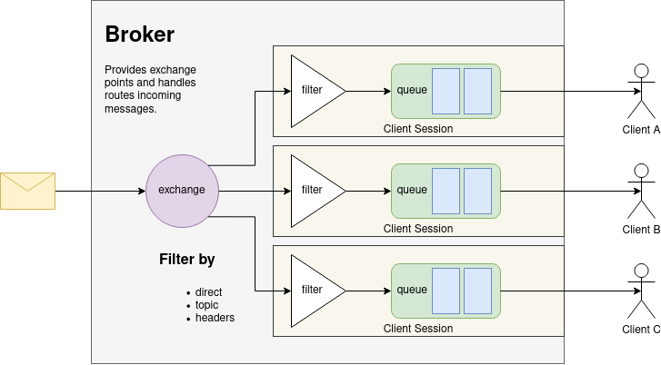

# Sample Implementation using libconnector

This project demonstrates various calls to the connector and helper functions as runnable example.
To do so, it provides three main examples:

 * _Echo mode_: Some (gibberish) messages are sent and expected to be received in the same order.

   Demonstrates:
    * Basic connection setup
    * Sending (custom, gibberish) messages
    * Receiving (typed and untyped) messages

   
 * _Fusion demo_: Basic implementation which orientates on the behaviour of the fusion algorithm.
   It sends `DENM` messages until aborted.
   
   Demonstrates:
     * Basic connection setup
     * Sending messages


* _Vehicle demo_: Implementation which orientates on the behaviour of a vehicle (sending and receiving messages).
  
   Demonstrates
     * Advanced connection initialization
     * Advanced reconnect checks
  * Sending and receiving messages


### Build the binary

Build asn1c (only required to be executed once):
```bash
./build_asn1c.sh
```

Build the binary, run a fusion and vehicle demo
(use `CTRL+C` to stop the demo):
```bash
./build_and_run.sh
```


Look at the script to infer how to build and run a single demo instance:
```bash
$ cat build_and_run.sh 
#!/bin/bash

cd `dirname "$0"`
rm -rf cmake-build-release && \
  mkdir cmake-build-release && \
  cd cmake-build-release && \
  cmake -DCMAKE_BUILD_TYPE=Release .. && \
  make -j$(nproc) && \
  (./sample_client --demo-vehicle&) && \
  ./sample_client --demo-fusion
```

Successive builds commands can be reduced to the following:
```bash
$ cd cmake-build-release
$ make -j$(nproc)
$ ./sample_client ...
```

To build in debug mode, run the following:
```bash
$ mkdir cmake-build-debug
$ cd cmake-build-debug
$ cmake ..
$ make -j$(nproc)
$ ./sample_client ...
```

### Binary parameters

Once the project is compiled to a single binary, the following listing shows valid parameters:

 * No `--demo-` prefixed parameter: start in echo mode

 * `--demo-fusion`: start fusion-demo (must be the first parameter)

 * `--demo-vehicle`: start vehicle-demo (must be the first parameter)

 * `--debug` (only in vehicle-demo): Subscribes to `ComponentStatus` messages

 * `--host` (only in vehicle-demo): Overwrites the host address (`localhost:5672`)


## Run a AMQP 1.0 Broker

The AMQP 1.0 broker is the central message exchange point and therefore required by all participants.
To following steps are required to successfully run an AMQP 1.0 broker within LUKAS (with a more detailed explanation below).

 1. Start the broker (preferably as docker container)
 2. Create the main message exchange point
 3. Execute your test(s)
 

### Start via Docker-Hub (be aware, it is user content!)

Allow any client to connect:
```bash
docker run -p 5672:5672 -it --rm --name qpid-broker scholzj/qpid-cpp
```

Require username and password authentication:
```bash
docker run -p 5672:5672 -it --rm --name qpid-broker -e QPIDD_ADMIN_USERNAME=prod1 -e QPIDD_ADMIN_PASSWORD=password1 scholzj/qpid-cpp
```

### Start via local build

```bash
git clone https://github.com/scholzj/docker-qpid-cpp.git
```

_Optional_
 * Inspect `Dockerfile`
 * Inspect `docker-entry.sh`

Build the image (in this example, it is also called `qpid-cpp`):
```bash
cd docker-qpid-cpp
docker build -t qpid-cpp .
```

Run it (same as the one liner from for the image from the Docker-Hub, but the local image name instead):
```bash
docker run -p 5672:5672 -it --rm --name qpid-broker qpid-cpp
```
or
```bash
docker run -p 5672:5672 -it --rm --name qpid-broker -e QPIDD_ADMIN_USERNAME=prod1 -e QPIDD_ADMIN_PASSWORD=password1 qpid-cpp
```

### Configure the broker
(The following is a per container-instance one-time setup requirement)

Within AMQP 1.0, messages are primarily delivery to so called 'exchange' points.
Clients can attach delivery queues to those points to receive a copy of each message delivered to the exchange.
Optionally, clients can also specify filters here, which can be used to reduce bandwidth usage by ignoring unrelated messages on the server side before transmission.



LUKAS uses its own exchange point called `messages` - which must be created before it can be used.
The filter-type is set to `headers` to allow the most flexible client filters.
With the tool `qpid-config`, an invocation for that - and the credential configuration from above - would look like the following:

```bash
qpid-config -b localhost:5672 add exchange headers messages
```
or
```bash
qpid-config -b prod1/password1@localhost:5672 add exchange headers messages
```

This approach would require the that `qpid-config is also installed on the host system.
To avoid this, one can use the copy within the docker container which already runs the broker, like that:

```bash
docker exec -it qpid-broker qpid-config -b localhost:5672 add exchange headers messages
```
or
```bash
docker exec -it qpid-broker qpid-config -b prod1/password1@localhost:5672 add exchange headers messages
```


### FAQ
 * **Connection status toggles between `Initializing` and `Disconnected`**

   Most probably the authentication (`ANONYMOUS` vs `PAIN` with username and password) method or login credentials
   do not match the ones from the docker run configuration.
   See the usage of `cr_config_set_login_anonymous`, `cr_config_set_login_user` and `cr_config_set_login_password`.

 * **I don't receive my own messages**

   The default behaviour of the connector sets a receive-filter that prevents messages sent by the application to be received by it again.
   If this is not your expected behaviour, use `cr_config_set_receive_own` to disable this. 

### Additional Docker notes

Install docker either via `apt install docker.io` (might be heavily outdated), or follow these instructions: https://docs.docker.com/engine/install/ubuntu/

 * The parameter `--name <name>` names the container as specified.
 * The parameter `--rm` will delete the container once stopped. 
 * The parameter `-it` will start the container interactively, meaning, attaching the current console to it.
   To detach from it, press `CTRL+P` & `CTRL+Q`.
   The shortcut `CTRL+C` will be forwarded to the internal process and stop it.
   For re-attaching see `docker attach`.
   To stop the (background) container, execute `docker stop qpid-broker -t 0`, where `qpid-broker` is the name and `-t <time>` the timeout until forcibly killed (0 => immediately, docker default is ~10s).
 * The parameters `-e ...` specify environment variables for the container
 * To run a container continuously in the background (even after reboots, see `--restart ...`):
   
   `docker run -p 5672:5672 -d --restart unless-stopped --name qpid-broker -e QPIDD_ADMIN_USERNAME=prod1 -e QPIDD_ADMIN_PASSWORD=password1 qpid-cpp`
   
 * List all (running) docker containers: `docker ps`